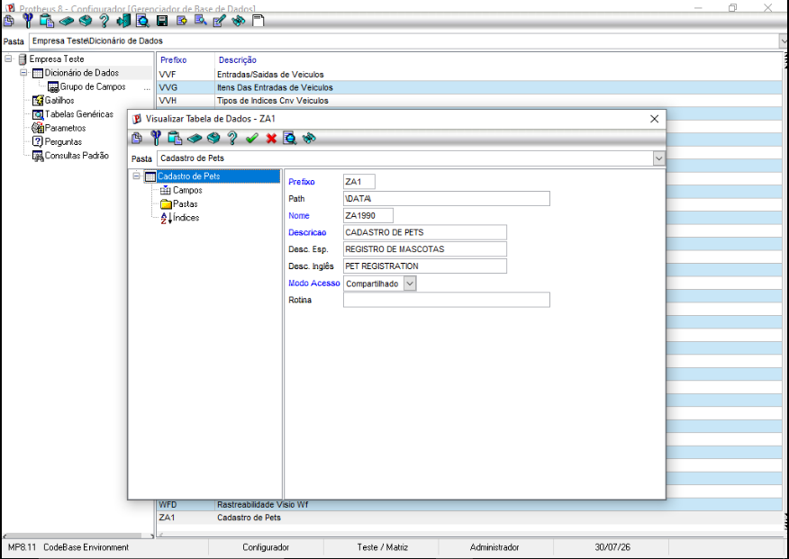
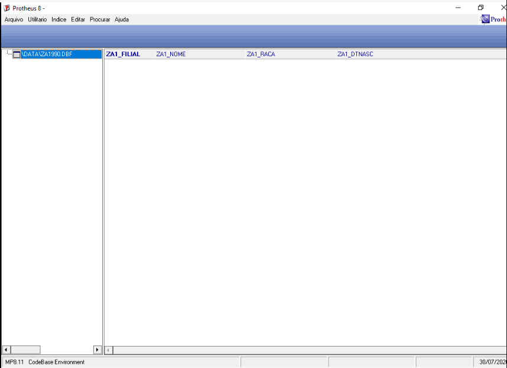

# Exercício 3 — Criação da Tabela ZA1 no Ambiente Protheus

## a. Cadastro no Dicionário (SX2/SX3)

Via **Configurador (SIGACFG)** → Base de Dados → Dicionário → Bases de Dados:

- **SX2**: criação do arquivo `ZA1`, descrição "Cadastro de Pets".
- **SX3**: inclusão dos campos `ZA1_FILIAL`, `ZA1_NOME`, `ZA1_RACA`, `ZA1_DTNASC`.

**Desafio encontrado**: restrição de tamanho de título no Browse — o sistema limita os caracteres do cabeçalho da coluna, exigindo abreviar títulos longos (ex.: "Data de Nascimento" → "Dt Nasc").

## b. Forçar o reconhecimento da tabela

Ao salvar a estrutura no Configurador, a tabela é registrada em SX2/SX3, mas o **arquivo físico não é criado automaticamente** e só surge quando alguma rotina acessa a tabela.

**Solução aplicada**: no módulo **SIGAMDI** → Atualizações → Cadastros → Fórmulas, criamos uma fórmula simples com:

```advpl
dbSelectArea("ZA1")
```

Ao executar, o interpretador tenta selecionar a área de trabalho da tabela; como ela ainda não existe fisicamente, o Protheus dispara a criação automática nos bastidores.

## c. Conferência no MPSDU

- Tabela localizada pelo alias + empresa + filial de teste (`ZA1990`).
- Todas as colunas confirmadas: `ZA1_FILIAL`, `ZA1_NOME`, `ZA1_RACA`, `ZA1_DTNASC`, prontas para receber dados.





