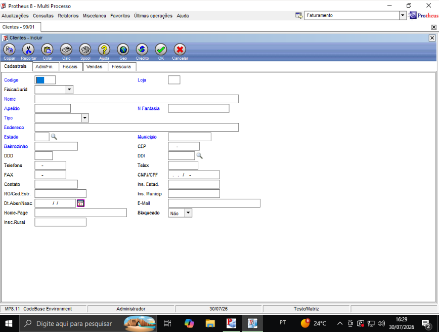

# Exercício 4 — Campo Customizado A1_XAPELID na Tabela SA1

## a. Definição do campo no Configurador

Caminho seguido: **SIGACFG → Base de Dados → Dicionário → Bases de Dados**

- Selecionada a tabela de cadastro de clientes (**SA1**) e aberta em modo de edição.
- Acessado **Campos → Incluir** para criar o novo campo.

**Configuração do campo**:

| Propriedade  | Valor              |
| ------------ | ------------------ |
| Nome         | `A1_XAPELID`       |
| Tipo         | Caracter (C)       |
| Tamanho      | 12                 |
| Título      | Apelido            |
| Descrição  | Apelido do Cliente |
| Obrigatório | Sim                |

O campo foi vinculado à pasta **"1 - Cadastrais"** (Pastas → 1 - Cadastrais → Editar → Campos → Incluir), garantindo que ele apareça agrupado com os demais dados cadastrais do cliente.

**Ajuste de posição**: por padrão o novo campo é adicionado ao final da pasta, mas ele foi reposicionado para ficar próximo ao campo `A1_NOME`, tornando o formulário de cadastro mais semântico e intuitivo para quem for preenchê-lo.

## b. Validação no SmartClient

Após salvar a estrutura no Configurador, o SmartClient foi reaberto na rotina de **Cadastro de Clientes (SA1)**, no formulário **Clientes - Incluir**, aba **Cadastrais**. O print abaixo confirma o resultado: o campo **"Apelido"** aparece logo abaixo do campo **"Nome"**, exatamente na posição planejada, pronto para uso, **sem necessidade de escrever nenhuma linha de código**, comprovando que o Dicionário de Dados (SX3) por si só já é capaz de refletir a mudança na interface.

Esse comportamento reforça o mesmo princípio visto com o campo `A1_VOVO`: alterações estruturais simples (novos campos em pastas já existentes) são absorvidas automaticamente pelo framework do Protheus, sem exigir programação em ADVPL.
