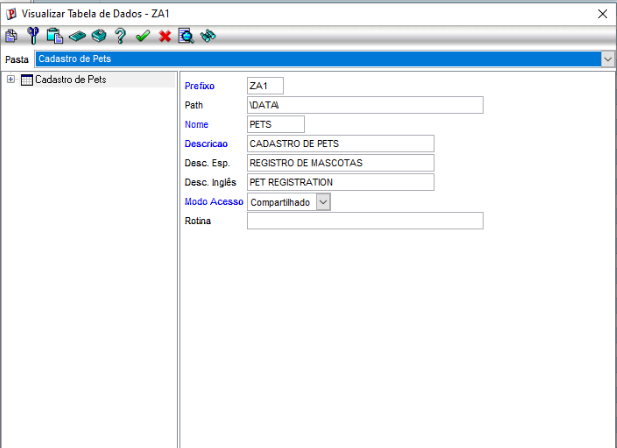
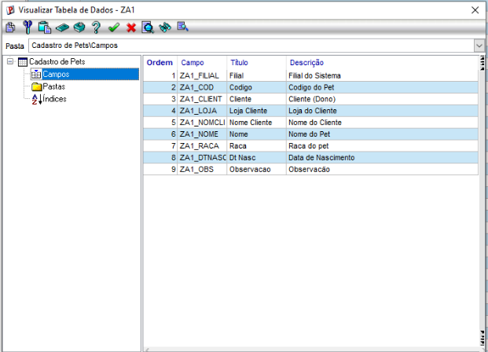
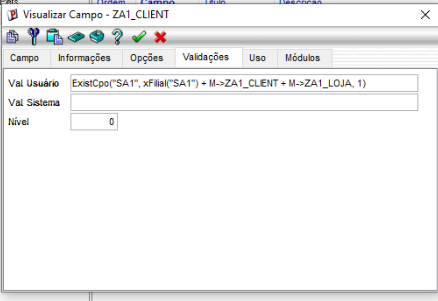
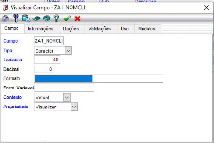
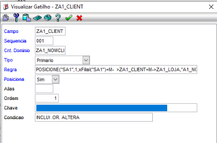
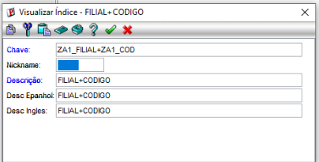
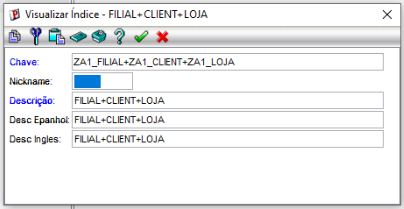

# Exercício 2 — Completando a tabela ZA1 (o pet ganha um dono)

## Objetivo

Completar a tabela `ZA1` (Pets) no Configurador (SIGACFG), amarrando cada pet a um cliente (`SA1`) através dos campos `ZA1_CLIENT` e `ZA1_LOJA`, e exibindo o nome do dono via campo virtual `ZA1_NOMCLI`.

## O que foi feito

### 1. Cadastro dos campos (SX3)

Todos os campos da tabela foram conferidos/ajustados conforme a especificação da apostila:


| Campo       | Tipo | Tamanho | Contexto |
| ----------- | ---- | ------- | -------- |
| ZA1\_FILIAL | C    | 2       | Real     |
| ZA1\_COD    | C    | 6       | Real     |
| ZA1\_CLIENT | C    | 6       | Real     |
| ZA1\_LOJA   | C    | 2       | Real     |
| ZA1\_NOMCLI | C    | 40      | Virtual  |
| ZA1\_NOME   | C    | 30      | Real     |
| ZA1\_RACA   | C    | 20      | Real     |
| ZA1\_DTNASC | D    | 8       | Real     |
| ZA1\_OBS    | C    | 60      | Real     |

### 2. Configuração do campo ZA1\_CLIENT (lookup para o cliente)

* Validação de usuário aplicada: `ExistCpo("SA1", xFilial("SA1") + M->ZA1_CLIENT + M->ZA1_LOJA, 1)` — garante que o código de cliente + loja digitado realmente existe na tabela SA1.

### 3. Configuração do campo ZA1\_NOMCLI (nome do cliente, virtual)

* Contexto definido como **Virtual** (não grava no banco).
* Tipo Caractere, tamanho 40.

**Observação sobre uma limitação encontrada:** nesta versão do Protheus (build `7.00.050131A`, 2005), a tela de edição de campo do Configurador não expõe um campo chamado literalmente "Relação" (`X3_RELACAO`) em nenhuma das abas disponíveis (Campo, Informações, Opções, Validações, Uso, Módulos). Durante a investigação, foi identificado que o campo **"Inic. Padrão"** (aba Opções) cumpre um propósito equivalente ao de uma Relação — ambos preenchem o valor de um campo Virtual a partir de uma fórmula — mas com uma diferença de comportamento: o "Inic. Padrão" roda apenas no momento em que o registro é **incluído**, enquanto uma Relação (X3\_RELACAO), quando disponível, recalcula o valor **toda vez** que a tela ou o browse exibe o registro (por exemplo, refletindo uma troca posterior de cliente sem precisar reincluir o pet).

Por conta dessa diferença, e para garantir que o nome do cliente também se atualize em caso de **alteração** do dono do pet (não só na inclusão), o recálculo automático foi implementado através de um **Gatilho (SX7)** associado ao campo `ZA1_CLIENT`, configurado na condição `INCLUI.OR.ALTERA`, com a seguinte regra:

```
POSICIONE("SA1",1,xFilial("SA1")+M->ZA1_CLIENT+M->ZA1_LOJA,"A1_NOME")
```

configurado para disparar na condição `INCLUI.OR.ALTERA`, e posicionando o resultado no campo `ZA1_NOMCLI`.

### 4. Criação dos índices (SIX)

* **Índice 1** — `ZA1_FILIAL + ZA1_COD` (chave primária)
* **Índice 2** — `ZA1_FILIAL + ZA1_CLIENT + ZA1_LOJA` (busca dos pets por cliente/dono)

### 5. Consulta padrão (SXB)

Como o `ZA1_CLIENT` busca um cliente, foi utilizada a consulta padrão nativa do Protheus para clientes (`SA1010`), sem necessidade de criar uma consulta própria no SXB.

* Campo: `ZA1_CLIENT`
* Aba: **Opções**
* Campo "Cons. Padrão": `SA1010` (exibido como "Cliente")

## Prints necessários para a entrega














